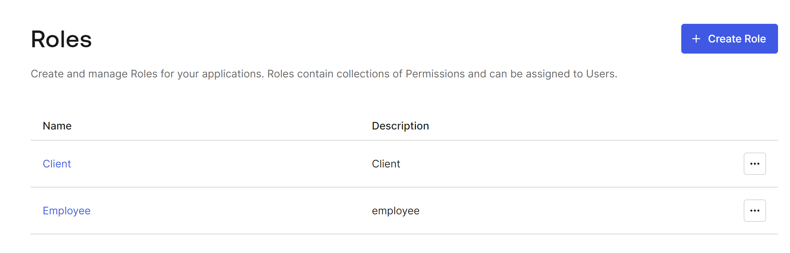

# Backend - Trivia API

## Setting up the Backend

### Install Dependencies

```bash
pip install -r requirements.txt
```
### Virtual environment
Create a virtual environment
```bash
python3 -m venv myvenv
source myvenv/bin/activate
```

### Set up the Database

With Postgres running, create a `trivia` database:

```bash
dropdb trivia
createdb trivia
```


### Auth0 Setup
### Create Auth0 Application


### Create Auth0 API and Permissions


### Create Auth0 Roles and Users


Client: [client_permisson](images//client_permisson.png)

Employee: [client_employee](images//client_employee.png)
### Run the Server

From within the `./src` directory

To run the server, execute:

```bash
flask run
```

URL backend: http://localhost:5000/

## Test Backend
```bash
python test_api.py
```
It will run slow, please wait 1 minutes, because I connect Database from postgres of render
Results:
```
.
----------------------------------------------------------------------
Ran 29 tests in 8.607s

```

### Documentation
### API Reference
`GET '/categories'`

- Fetches a dictionary of categories in which the keys are the ids and the value is the corresponding string of the category
- Request param: None
- Example reponse:

```json
{
    "categories": {
        "1": "Science",
        "2": "Art",
        "3": "Geography",
        "4": "History",
        "5": "Entertainment",
        "6": "Sports"
    },
    "success": true
}
```

`GET '/questions?page=<page_number>'`
Fetch a pagination dictionary of questions 
- Request param (optional): page:int 
- Example reponse: 
```json
{
    "categories": {
        "1": "Science",
        "2": "Art",
        "3": "Geography",
        "4": "History",
        "5": "Entertainment",
        "6": "Sports"
    },
    "currentCategory": 1,
    "questions": [
        {
            "answer": "Apollo 13",
            "category": 5,
            "difficulty": 4,
            "id": 2,
            "question": "What movie earned Tom Hanks his third straight Oscar nomination, in 1996?"
        },
        {
            "answer": "Tom Cruise",
            "category": 5,
            "difficulty": 4,
            "id": 4,
            "question": "What actor did author Anne Rice first denounce, then praise in the role of her beloved Lestat?"
        },
        {
            "answer": "Maya Angelou",
            "category": 4,
            "difficulty": 2,
            "id": 5,
            "question": "Whose autobiography is entitled 'I Know Why the Caged Bird Sings'?"
        },
        {
            "answer": "Edward Scissorhands",
            "category": 5,
            "difficulty": 3,
            "id": 6,
            "question": "What was the title of the 1990 fantasy directed by Tim Burton about a young man with multi-bladed appendages?"
        },
        {
            "answer": "Muhammad Ali",
            "category": 4,
            "difficulty": 1,
            "id": 9,
            "question": "What boxer's original name is Cassius Clay?"
        },
        {
            "answer": "Brazil",
            "category": 6,
            "difficulty": 3,
            "id": 10,
            "question": "Which is the only team to play in every soccer World Cup tournament?"
        },
        {
            "answer": "Uruguay",
            "category": 6,
            "difficulty": 4,
            "id": 11,
            "question": "Which country won the first ever soccer World Cup in 1930?"
        },
        {
            "answer": "George Washington Carver",
            "category": 4,
            "difficulty": 2,
            "id": 12,
            "question": "Who invented Peanut Butter?"
        },
        {
            "answer": "Lake Victoria",
            "category": 3,
            "difficulty": 2,
            "id": 13,
            "question": "What is the largest lake in Africa?"
        },
        {
            "answer": "The Palace of Versailles",
            "category": 3,
            "difficulty": 3,
            "id": 14,
            "question": "In which royal palace would you find the Hall of Mirrors?"
        }
    ],
    "success": true,
    "total_questions": 22
}

`DELETE '/questions/<int:question_id>'`

- Delete an existing question
- Request param: question_id:int
- Example reponse:

```json
{
    "deleted": 29,
    "success": true,
}
```

`POST '/questions'`

- Create new question
- Request param: {
    "question": string,
    "answer": string,
    "difficulty": int,
    "category": int
}
- Example reponse:

```json
{
    "created": 34,
    "success": true,
}
```
`POST '/questions'`

- Fetches all questions have substring include the search term (not case-sensitive)
- Request param: {
    "searchTerm": string,
}
- Example reponse:

```json
{
    "currentCategory": 1,
    "questions": [
        {
            "answer": "Maya Angelou",
            "category": 4,
            "difficulty": 2,
            "id": 5,
            "question": "Whose autobiography is entitled 'I Know Why the Caged Bird Sings'?"
        }
    ],
    "success": true,
    "total_questions": 1
}
```

`POST '/categories/<int:category_id>/questions'`

- Fetches all questions for the specified category
- Request param: category_id:int
- Example reponse:

```json
{
    "questions": [
        {
            "answer": "The Liver",
            "category": 1,
            "difficulty": 4,
            "id": 20,
            "question": "What is the heaviest organ in the human body?"
        },
        {
            "answer": "Alexander Fleming",
            "category": 1,
            "difficulty": 3,
            "id": 21,
            "question": "Who discovered penicillin?"
        },
        {
            "answer": "Blood",
            "category": 1,
            "difficulty": 4,
            "id": 22,
            "question": "Hematology is a branch of medicine involving the study of what?"
        },
        {
            "answer": "123",
            "category": 1,
            "difficulty": 1,
            "id": 34,
            "question": "aloha"
        }
    ],
    "success": true,
    "total_questions": 4
}
```
`POST '/quizzes'`

- Fetch only one random question with a specified category.
- Request param: {
    "previous_questions": array,
    "quiz_category": {
        "type": string,
        "id": number
    }
   }
- Example reponse:

```json
{
    "question": {
        "answer": "The Liver",
        "category": 1,
        "difficulty": 4,
        "id": 20,
        "question": "What is the heaviest organ in the human body?"
    },
    "questions": [
        {
            "answer": "The Liver",
            "category": 1,
            "difficulty": 4,
            "id": 20,
            "question": "What is the heaviest organ in the human body?"
        },
        {
            "answer": "Alexander Fleming",
            "category": 1,
            "difficulty": 3,
            "id": 21,
            "question": "Who discovered penicillin?"
        },
        {
            "answer": "Blood",
            "category": 1,
            "difficulty": 4,
            "id": 22,
            "question": "Hematology is a branch of medicine involving the study of what?"
        },
        {
            "answer": "123",
            "category": 1,
            "difficulty": 1,
            "id": 34,
            "question": "aloha"
        }
    ],
    "success": true,
    "total_questions": 4
}
```


## Frontend
### Install Dependencies
```
cd frontend
npm install
```

### Run Frontend Server
```
npm start
```
```
